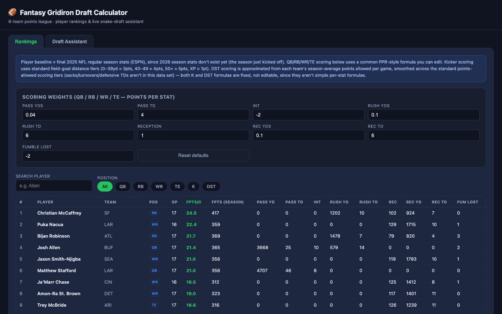

# Fantasy Gridiron Draft Calculator

Player rankings and a live snake-draft assistant for an 8-team fantasy
football points league, with scoring weights you can edit.

**Live demo:** _add GitHub Pages link here_

## What it does

- **Editable scoring.** Change per-stat point values (passing yards, TDs,
  receptions, etc.) and every ranking updates instantly.
- **Rankings.** Season and per-game fantasy points for QB/RB/WR/TE/K/DST,
  filterable by position and searchable.
- **Draft assistant.** Track a snake draft pick by pick, see your roster,
  the best available players, and live team ratings.

## Design notes

<!-- Fill these in. This is the part a UX reviewer reads most closely. -->

- **Who it's for / the problem:** _…_
- **Key decisions:** _Why expose scoring weights up front? Why tabs for
  Rankings vs. Draft Assistant?_
- **Feedback & iteration:** _…_
- **What I'd do next:** _…_

## How it's built

A single self-contained `index.html` (HTML/CSS/vanilla JS), no build step.
Baseline stats are final 2025 NFL regular-season numbers from ESPN.
